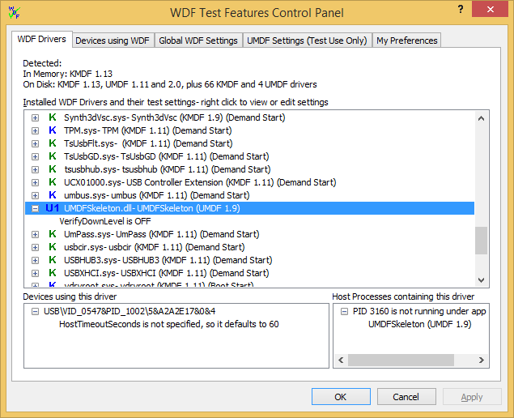

# WDF Drivers Tab

This topic provides detailed information about WDF Verifier's **WDF Drivers** page. This page lists all WDF drivers on the computer, and you can change their verification settings and the settings of devices that use them. Start here if you're interested in a specific driver.

When you start up the application, you'll see a list of the WDF drivers and runtime versions currently on the system. Each line includes the name of the driver binary, its service display name, framework version, and, for KMDF drivers, start type.

When you highlight a driver, you'll see any devices currently using that driver, as well as related UMDF host processes. The host process control is only visible when a running UMDF driver is selected.

## Color Scheme

For each driver, a color-coded icon indicates if it uses KMDF, UMDF 1 or UMDF 2.

The color code indicates the driver's status and what you need to do so that changes to the driver's verification settings take effect.

-   Blue indicates that the driver is in use and is associated with one or more PnP devices. For changes to take effect, you need to disable and reenable these devices. You can choose if WDF Verifier does this for you on the **My Preferences** tab. For these drivers, you get a list of associated devices.
-   Red indicates that a driver is in use, but it is not associated with a PnP device. For changes to take effect:
    -   For KMDF, you must reboot.
    -   For UMDF, you must stop and restart all UMDF host processes.
-   Green indicates that the driver is not currently in use. If you change settings, the changes take effect the next time the driver is loaded.

## Preset Options

For drivers that have driver-specific settings (KMDF and UMDF 2), right-click the driver name for the following quick option menu:

-   Set to default settings.
-   Enable WDF breakpoints and VERIFY macros in the driver code.
-   Enable all recommended test settings (verifier on, verbose and larger IFR buffer, downlevel verification).

If you change the driver’s settings but haven't committed the changes, (\*) appears after the driver name, and the menu includes an additional option to undo changes.

## Changing Individual Verification Settings for a Driver

Click the + to the left of the color icon to see a driver's current verification settings. You can right-click on individual options to change them.

Right-clicking a Boolean setting toggles it. Some settings present a list of valid options, while others present an edit control where you can type a value. The app beeps if you enter an invalid value. Press **Enter** to use your new value or click outside the control to cancel the change.

You must enter a hexadecimal value in **AllocateFailCount**, and a decimal value for **HostTimeoutSeconds**.

If you enable a feature that requires KMDF Verifier on, and the **VerifierOn** option is currently off, the app turns it on. You can still disable it manually. In this case, the text describing the feature indicates what it would do if Verifier were on. Similar changes in text describing a setting’s state can be seen whenever a setting depends on other settings, or the usage of App Verifier or Driver Verifier.

If you start and stop devices or install new drivers, you must restart WDF Verifier to update the inventory.

If you make changes on the **WDF Drivers** page, you'll see those changes reflected on the **Devices using WDF** page.

 

 

[Send comments about this topic to Microsoft](mailto:wsddocfb@microsoft.com?subject=Documentation%20feedback%20[devtest\devtest]:%20WDF%20Drivers%20Tab%20%20RELEASE:%20%2811/17/2016%29&body=%0A%0APRIVACY%20STATEMENT%0A%0AWe%20use%20your%20feedback%20to%20improve%20the%20documentation.%20We%20don't%20use%20your%20email%20address%20for%20any%20other%20purpose,%20and%20we'll%20remove%20your%20email%20address%20from%20our%20system%20after%20the%20issue%20that%20you're%20reporting%20is%20fixed.%20While%20we're%20working%20to%20fix%20this%20issue,%20we%20might%20send%20you%20an%20email%20message%20to%20ask%20for%20more%20info.%20Later,%20we%20might%20also%20send%20you%20an%20email%20message%20to%20let%20you%20know%20that%20we've%20addressed%20your%20feedback.%0A%0AFor%20more%20info%20about%20Microsoft's%20privacy%20policy,%20see%20http://privacy.microsoft.com/default.aspx. "Send comments about this topic to Microsoft")

